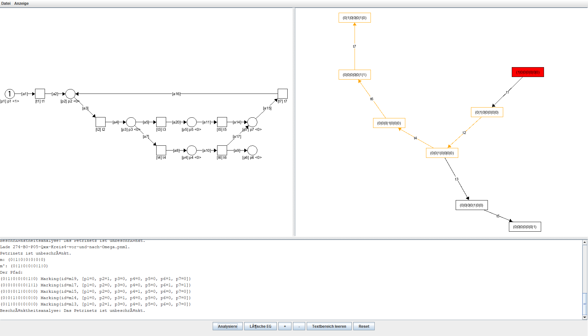
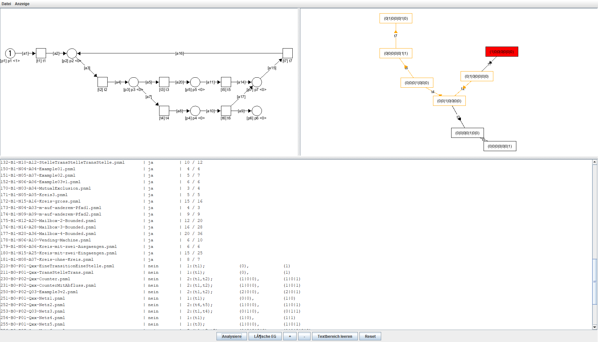
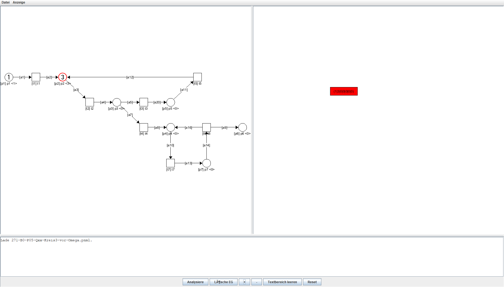
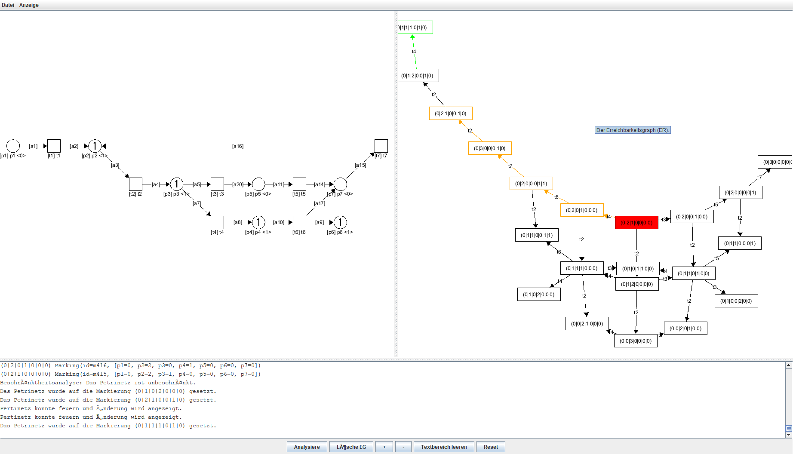
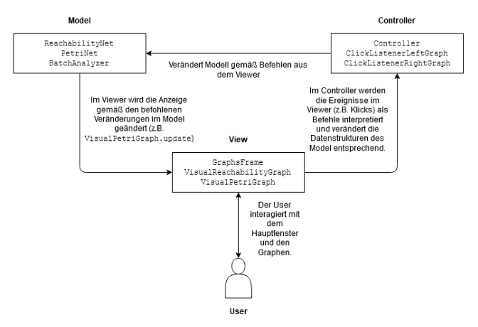

# petrinets
This is an university project from the winter semester of 2020/2021.
It reads a petri net structure from a `*.pnml` file and displays it.
From there, the petrinet can be edited by adding or removing tokens from places or triggering transitions by hand.

Also, you can create the petri net's reachability graph to determine whether it is limited or not.
If triggered by hand, the new node will be displayed in the reachability graph, too.

Additionally, you can perform a bulk analysis of several `*.pnml` files using the text window to find out whether they are limited or not.

## Functionality
### Load a petri net and analyze it
You can do so by clicking "Datei" and then "Öffnen" to open a `*.pnml` file. Click "Analysiere" to create its reachability graph. 

The square nodes display transitions and the circle nodes are places. The places have a number of tokens which can be seen as a number, if they have any.
Places follow the naming conventions `[ID] name <number of tokens>`. Transitions follow `[ID] name`. 
Edges only have a name.

The reachability graph's orange path shows the path meeting the condition that the petri net is unlimited. 
The red node is the root node i.e. the start state of the petri net.


### Bulk analysis
You can also do this analysis in bulk by clicking "Datei", then "Analyse mehrerer Dateien".
The following text will show you whether each net is limited, the number of nodes and edges and well as the path meeting the condition.


### Edit tokens of a place
You can add tokens to a place by clicking the desired place and then "+" or "-".
That will change the number of tokens contained but also the reachability graph which will have a new root node.


### Trigger transitions by hand
Do take a look at what happens if certain transitions are fired, you can simply click them.
The newest node in the reachability graph that results from firing will be displayed in green.


## Basic architecure

The architecute is a MVC pattern. The view is achieved using AWT and GraphStream.
The model and controller are all coded by hand.
The algorithm that detects whether the graph is limited can be found in the `model.ReachabilityGraph`:

```java
	/**
	 * Vervollständigt den Erreichbarkeitsgraphen.
	 * @param petriNet Das zum Erreichbarkeitsgraphen gehörige Petrinetz.
	 * @throws GraphIsUnlimitedException Wenn beim Aufbau des Erreichbarkeitsgraphen ein
	 * Paar von Markierungen gefunden wird, das darauf schließen lässt, dass dieser
	 * Erreichbarkeitsgraph unbeschränkt ist.
	 */
	public void analyze(PetriNet petriNet) throws GraphIsUnlimitedException {
		Set<String> transitionNames = new HashSet<String>();
		petriNet.getTransitions().forEach(trans -> transitionNames.add(trans.getId()));
		
		// Eine Liste aller Markierungen, von denen aus alle Transitionen einmal
		// gefeuert werden.
		List<Marking> fireQueue = new ArrayList<Marking>();
		markings.forEach(marking -> fireQueue.add(marking));

		// Diese Markierungen sind bereits vollständig untersucht.
		Set<Marking> alreadyFired = new HashSet<Marking>();
				
		while (fireQueue.size() > 0) {
			Marking origin = fireQueue.get(0);
			for (String transitionId : transitionNames) {
				// Aufbau des Petrinetzes zum Feuern der Transition.
				PetriNet firingNet = null;
				try {
					firingNet = petriNet.fromMarking(origin);					
				} catch (NodeNotFoundException e) {
					System.out.println(e.getMessage());
					fireQueue.remove(origin);
					break;
				}
				
				// Feuern der Transition, Einfügen des Ergebnisses in den
				// Erreichbarkeitsgraphen.
				try {
					firingNet.fire(transitionId);
					String transitionName = null;
					try {
						transitionName = firingNet.getTransitionById(transitionId).getName();
					} catch (NodeNotFoundException e) {
						transitionName = transitionId;
					}
					
					Marking afterFire = firingNet.getMarking();
					Marking newlyCreated = registerMarking(origin, afterFire, transitionId, transitionName);
					
					afterFire.setSourceTransitionId(transitionId);
					newlyCreated.setSourceTransitionId(transitionId);
					if (!alreadyFired.contains(newlyCreated)) {
						fireQueue.add(newlyCreated);
					}
					alreadyFired.add(newlyCreated);
					
					// Test, ob sich nach dem Feuern zwei Markierungen im Graphen befinden,
					// die das Unbeschränktheitskriterium erfüllen.
					Pair<Marking, Marking> causeBeingUnlimited = isUnlimitedDueTo();
					if (causeBeingUnlimited != null) {
						Marking m = causeBeingUnlimited.getFirst();
						Marking mStroke = causeBeingUnlimited.getSecond();
						
						List<Marking> pathBetween = new ArrayList<Marking>();
						pathBetween = getPathBetween(m, mStroke, pathBetween);
						List<MarkingToMarkingArc> arcPathBetween = new ArrayList<MarkingToMarkingArc>();
						try {
							arcPathBetween = getArcsBetweenMarkings(pathBetween);
						} catch (NodeNotFoundException e) {
							e.printStackTrace();
						}
						throw new GraphIsUnlimitedException(m, mStroke, pathBetween, arcPathBetween);
					}
					
				} catch (CannotFireException e) {
					continue;
				}
			}
			
			fireQueue.remove(origin);
		}
	}
```
